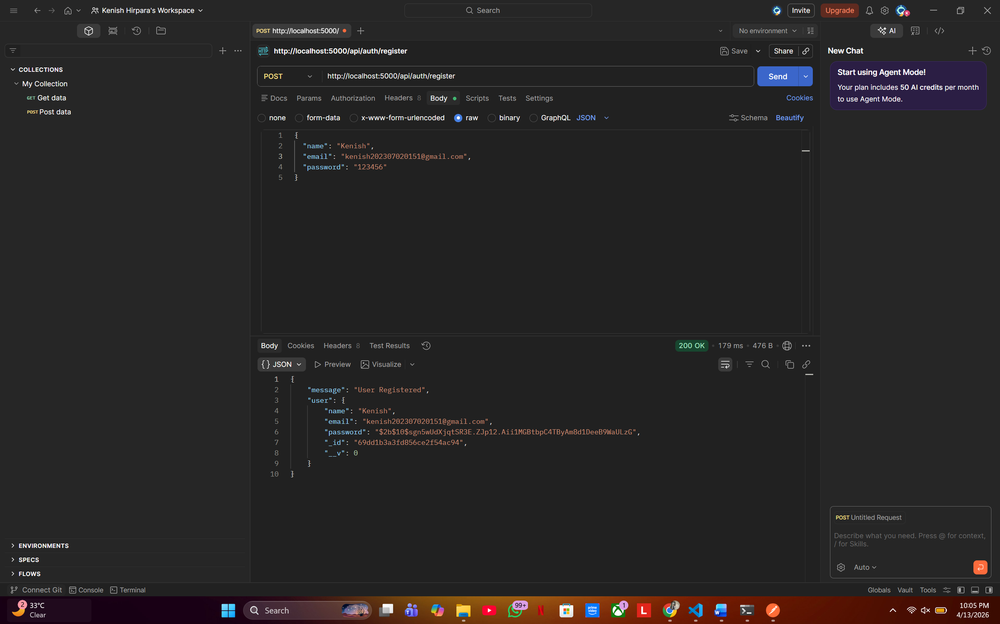
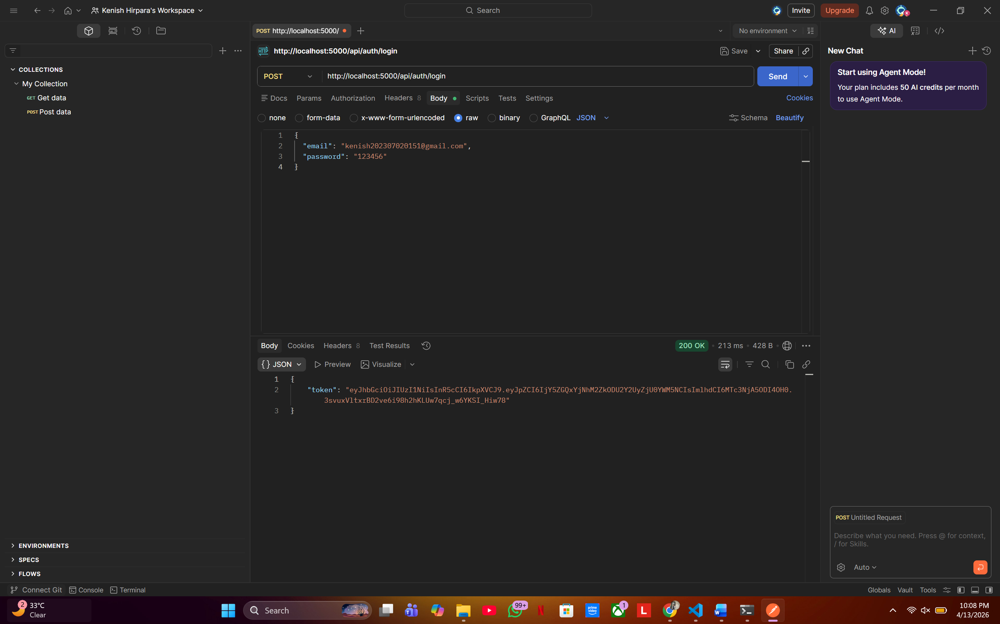
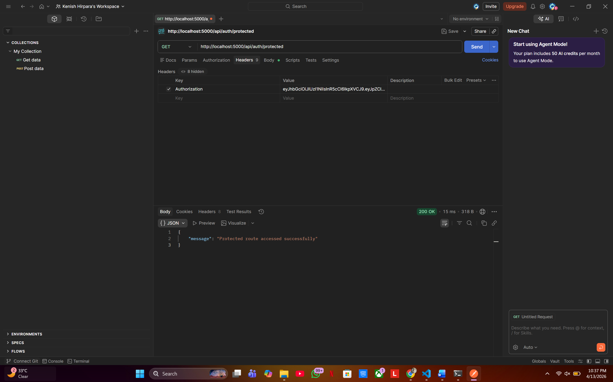
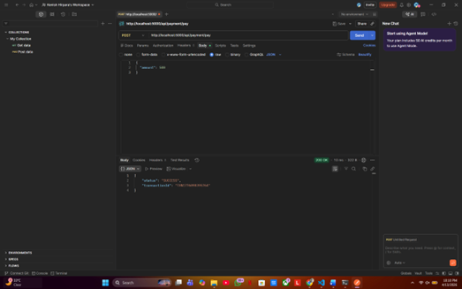
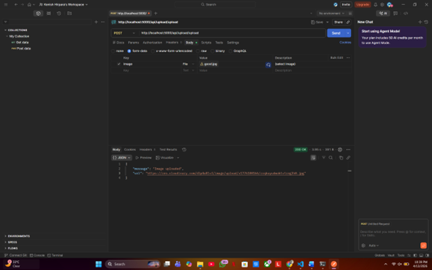

# 🚀 AuthFlow Pro API

## 📌 Description

AuthFlow Pro is a backend API project that implements secure user authentication using JWT, payment simulation, and image upload functionality using Cloudinary. It demonstrates real-world backend development concepts including security, API design, and cloud deployment.

---

## ✨ Features

* 🔐 User Registration & Login
* 🔑 JWT Authentication
* 🛡️ Protected Routes (Authorization)
* 💳 Payment Mock API (Simulation)
* 🖼️ Image Upload using Cloudinary
* 🌐 Deployed on Render
* 🧪 API Testing using Postman

---

## 🛠️ Tech Stack

* **Backend:** Node.js, Express.js
* **Database:** MongoDB Atlas
* **Authentication:** JSON Web Token (JWT)
* **File Upload:** Multer + Cloudinary
* **Testing Tool:** Postman
* **Deployment:** Render
* **Version Control:** Git & GitHub

---

## 📂 Project Structure

```
authflow-pro/
│── controllers/
│── routes/
│── middleware/
│── models/
│── config/
│── screenshots/
│── server.js
│── package.json
│── .env (not included)
```

---

## 🚀 API Endpoints

### 🔐 Authentication

* **POST** `/api/auth/register` → Register new user
* **POST** `/api/auth/login` → Login user & get JWT token
* **GET** `/api/auth/protected` → Access protected route

---

### 💳 Payment

* **POST** `/api/payment/pay` → Mock payment API

---

### 🖼️ Image Upload

* **POST** `/api/upload/upload` → Upload image to Cloudinary

---

## 🧪 Testing

All APIs were tested using Postman.
Each endpoint was verified with proper request and response.

---

## 🌐 Live Demo

👉 https://authflow-pro-epdc.onrender.com

---

## 📸 Screenshots

### 🔹 Register API



### 🔹 Login API



### 🔹 Protected Route



### 🔹 Payment API



### 🔹 Image Upload



---

## ⚙️ Setup Instructions

### 1. Clone the repository

```
git clone https://github.com/KenishHirpara/authflow-pro.git
cd authflow-pro
```

### 2. Install dependencies

```
npm install
```

### 3. Create `.env` file

Add the following variables:

```
MONGO_URI=your_mongodb_uri
JWT_SECRET=your_secret_key
CLOUD_NAME=your_cloud_name
API_KEY=your_api_key
API_SECRET=your_api_secret
PORT=5000
```

### 4. Run the server

```
npm start
```

---

## 🔐 Environment Variables

| Variable   | Description               |
| ---------- | ------------------------- |
| MONGO_URI  | MongoDB connection string |
| JWT_SECRET | Secret key for JWT        |
| CLOUD_NAME | Cloudinary cloud name     |
| API_KEY    | Cloudinary API key        |
| API_SECRET | Cloudinary API secret     |
| PORT       | Server port               |

---

## 🎯 Features Demonstrated

* Secure authentication using JWT
* Password hashing using bcrypt
* Middleware-based route protection
* RESTful API design
* Cloud file upload handling
* Deployment on cloud platform

---

## 📚 Learning Outcomes

* Learned backend API development
* Understood authentication & security
* Gained experience in deployment
* Practiced API testing

---

## 👨‍💻 Author

**Kenish Hirpara**

---

## ⭐ Support

If you like this project, consider giving it a ⭐ on GitHub!
